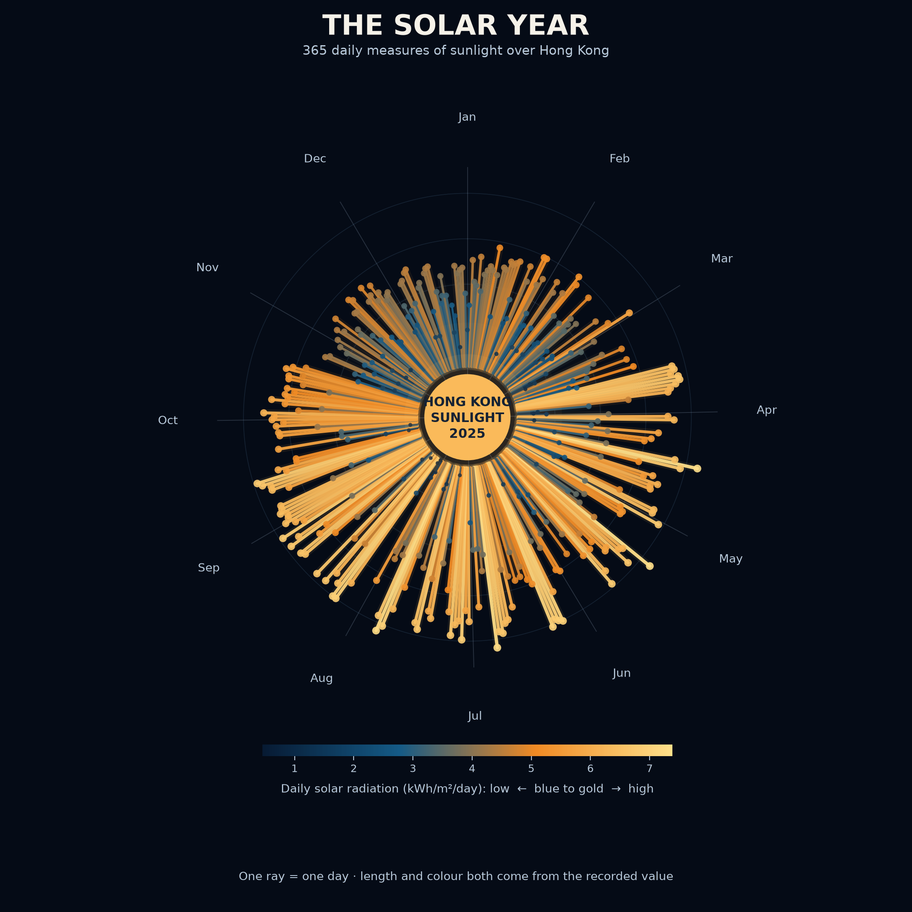

# Hong Kong solar rhythm



## The phenomenon

Sunlight changes across a year, but the change is not a smooth climb from winter to summer and back again. Cloud, rain, haze, and weather systems make neighbouring days very different. This project follows the daily solar radiation received near Hong Kong throughout 2025. I chose this phenomenon because it connects a familiar local place to a cycle that is both seasonal and irregular. Instead of treating the year as a straight line, the picture treats it as one complete turn. January begins at the top of the circle and the days move clockwise until December returns to the starting point.

## The source

The raw data comes from the [NASA POWER daily point API](https://power.larc.nasa.gov/api/temporal/daily/point?parameters=ALLSKY_SFC_SW_DWN&community=RE&longitude=114.1694&latitude=22.3193&start=20250101&end=20251231&format=CSV). It supplies the `ALLSKY_SFC_SW_DWN` measure for latitude 22.3193 and longitude 114.1694, close to Hong Kong. The committed CSV contains 365 daily rows. Each row gives a year, month, day, and the daily all-sky surface shortwave downward irradiance in kWh/m²/day. `fetch.py` downloads the reply once and saves it unchanged in `data/`; `plot.py` works from that saved file, so the visualisation can be reproduced offline.

## What the picture shows

The image is a radial calendar and a data artwork. Every ray represents one recorded day. Its position represents the date, while both its length and its colour represent solar radiation: shorter blue rays are lower-radiation days, and longer gold rays are higher-radiation days. The calendar rings and month labels make the annual cycle visible, while the bright clusters reveal periods when many high-radiation days occurred together. The picture makes seasonal rhythm and sudden daily variation easy to notice.

It hides some things deliberately. The ray lengths are scaled between the lowest and highest recorded values, so they are not a direct radial physical scale. A reader cannot precisely compare two close values without the colour scale, and the image does not explain why a particular day was cloudy or bright. It also represents one NASA POWER location estimate rather than every place in Hong Kong.

## Run it

```powershell
uv run fetch.py
uv run plot.py
```
